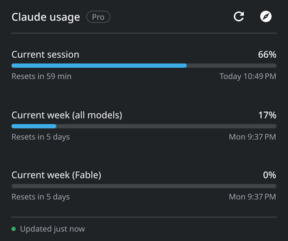
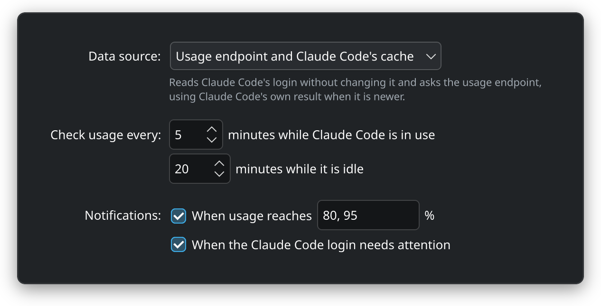

<!-- markdownlint-disable no-inline-html first-line-heading -->
<div align="center">



<h1>clankerwatch</h1>

<p>
  <a href="https://github.com/nicholas-fedor/clankerwatch/releases/latest"></a>
  
  <a href="LICENSE.md"></a>
</p>

<p><strong>Claude Code subscription usage in the KDE Plasma panel.</strong></p>

<p>
  <a href="https://clankerwatch.nickfedor.com/">Documentation</a> ·
  <a href="#installation">Installation</a> ·
  <a href="https://clankerwatch.nickfedor.com/configuration/">Configuration</a> ·
  <a href="CONTRIBUTING.md">Contributing</a>
</p>

</div>

## Overview

Clanker Watch is a KDE Plasma widget that shows you your Claude Code usage. It consists of two parts:

- **A Plasma 6 widget** that shows your usage in the panel and a popup with every limit.
- **A small static Go daemon** that D-Bus starts on demand. It reads Claude Code's login without ever changing it, asks Anthropic's usage endpoint at most every 5 minutes, and uses Claude Code's own cached result whenever that is newer.

## Quickstart

1. Install a [release package](#release-packages) or [install from source](#from-source) with `task install`.
2. Right-click the panel, choose **Add Widgets**, and add **Clanker Watch**. The widget starts its background service on its own, so there is nothing to enable.
3. Use Claude Code as usual. The widget fills in on its own, and a left click opens the popup.

## Installation

Requirements: KDE Plasma 6.4 or later, a systemd user session, and Claude Code signed in with a Claude subscription. Linux on `amd64` or `arm64`.

### Release packages

Every [release](https://github.com/nicholas-fedor/clankerwatch/releases/latest) has `.deb`, `.rpm`, `.apk`, and Arch packages. Install the one for your distribution:

- Debian, Ubuntu, and derivatives:

  ```sh
  sudo apt install ./clankerwatch_linux_*.deb
  ```

- Fedora, openSUSE, and other RPM distributions:

  ```sh
  sudo dnf install ./clankerwatch_linux_*.rpm
  ```

- Alpine:

  ```sh
  sudo apk add --allow-untrusted ./clankerwatch_linux_*.apk
  ```

- Arch and derivatives:

  ```sh
  sudo pacman -U ./clankerwatch_linux_*.pkg.tar.zst
  ```

> [!TIP]
> Releases are signed. See [Verify a download](https://clankerwatch.nickfedor.com/installation/#verify-a-download) to check one before installing it.

### From source

With Go 1.27 and [Task](https://taskfile.dev) (`go-task` on Arch):

```sh
task install     # daemon, systemd unit, D-Bus activation file, settings file, and widget
task update      # reinstall after pulling, restarting what changed
task uninstall   # remove everything except your settings and state
```

## Usage

- The panel shows the 5-hour session and the weekly limit. On a vertical panel each percentage sits over its bar.
- A left click opens the popup with every limit, its reset time, and extra usage. A middle click asks for a refresh.
- Bars turn to the theme's warning and critical colors at the alert thresholds, 80% and 95% by default, and a desktop notification fires when usage crosses them.
- Fonts and colors follow your Plasma theme.

If something looks wrong, see [troubleshooting](https://clankerwatch.nickfedor.com/troubleshooting/). The [CLI reference](https://clankerwatch.nickfedor.com/cli-reference/) covers the `clankerwatch` command.

## Configuration

<p align="center">
  
</p>

Right-click the widget and choose **Configure Clanker Watch…** to change the data source, the polling intervals, and the notifications. See the [configuration guide](https://clankerwatch.nickfedor.com/configuration/) for the settings file, environment variables, and flags.

## How it works

In the default **hybrid** mode, the daemon reads Claude Code's login from `~/.claude/.credentials.json` without ever writing it, and never refreshes the token, because a refresh would sign Claude Code out. It identifies itself honestly, sends the token only to `api.anthropic.com`, and backs off when the endpoint rate limits it. The widget only renders what the daemon publishes on the session bus. It starts no processes and never polls.

Anthropic's terms do not cover personal read-only use of Claude Code's login. Hybrid mode keeps that use minimal, and **cache-only** mode avoids it entirely. See [how it works](https://clankerwatch.nickfedor.com/how-it-works/) and [security](https://clankerwatch.nickfedor.com/security/) for the details.

## Contributing

Bug reports and pull requests are welcome. [CONTRIBUTING.md](CONTRIBUTING.md) explains how the project fits together, how to build, test, and lint it, and the rules every change follows.

## License

clankerwatch is free software under the [GNU Affero General Public License v3.0 or later](LICENSE.md).
